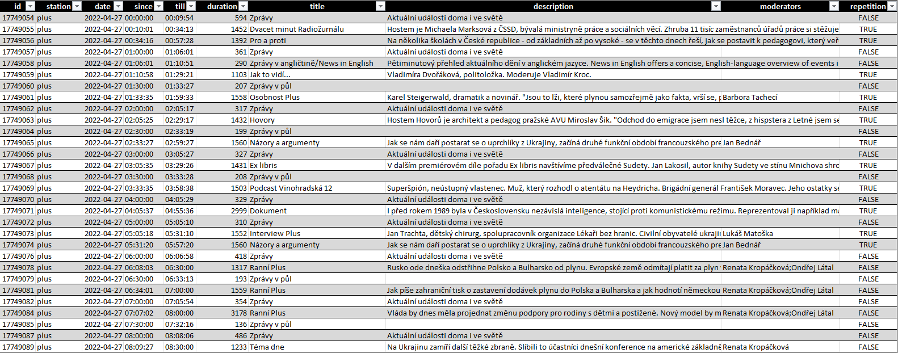

# 𝖈𝖗𝖔-𝖘𝖈𝖍𝖊𝖉𝖚𝖑𝖊-𝖘𝖉𝖐
[RELEASES](https://github.com/czech-radio/cro-schedule-sdk/releases/) | [WEBSITE](https://czech-radio.github.io/cro-schedule-sdk/)


[](https://github.com/czech-radio/cro.schedule/actions/workflows/main.yml)
[](https://sonarcloud.io/dashboard?id=czech-radio_cro.schedule)


**Python library to work with Czech radio schedule REST service.**

_The library contains a client and domain model to work with Czech Radio schedules. You will be able to download a schedule for the specified station(s) and period e.g day, week, month, etc. The schedule contains information about shows and you can  easily work with the domain model in your programs. At least you can export data to pandas data frame and play with that data._

> Of course our first reaction when consuming HTTP resources in Python is to reach for Requests. But for structured APIs, we often want more than ad-hoc calls to Requests. We want a client-side API for our apps. </br>
> -- Michael Kennedy (@mkennedy)

:star: Star us on GitHub — it motivates us!


## Install

**Prerequisites**

* We assume that you use at least Python 3.10.
* We assume that you use the virtual environment.

Install the package latest version from the GitHub repository.

```
pip install git+https://github.com/czech-radio/cro-schedule-sdk.git
```

## Features & Usage

Data are available many years to the past and circa 14 days to the future.

- [x] Get the available stations [[recipe](https://github.com/czech-radio/cro-schedule-sdk/blob/main/docs/source/notebooks/Recipe_Get_Stations.ipynb)].
- [ ] Get the schedule for all stations and given day [recipe].
- [x] Get the schedule for the given station and day [[recipe](https://github.com/czech-radio/cro-schedule-sdk/blob/main/docs/source/notebooks/Recipe_Get_Schedule_Day.ipynb)].
- [x] Get the schedule for the given station and week [[recipe](https://github.com/czech-radio/cro-schedule-sdk/blob/main/docs/source/notebooks/Recipe_Get_Schedule_Week.ipynb)].
- [x] Get the schedule for the given station and month [[recipe](https://github.com/czech-radio/cro-schedule-sdk/blob/main/docs/source/notebooks/Recipe_Get_Schedule_Month.ipynb)].
- [x] Get the schedule for the given station and year [[recipe](https://github.com/czech-radio/cro-schedule-sdk/blob/main/docs/source/notebooks/Recipe_Get_Schedule_Year.ipynb)].
- [x] Get the schedule for the given station, any period and time [[recipe](https://github.com/czech-radio/cro-schedule-sdk/blob/main/docs/source/notebooks/Recipe_Get_Schedule_Any.ipynb)].
- [ ] Get the playlist for supported stations (only Radio Wave) [recipe].
- [x] Convert schedule to `pandas.DataFrame` with `Schedule::to_table()` method.

See more examples in `docs/notebooks` and data outputs in `data` directory.

### Use as command line program


#### Get the day schedule

```
cro.schedule.sdk -p D -d 2022-02-01 -s plus -o .
```
```
Fetched 1 schedules for stations ['Plus', 'Radiozurnal'] and dates ['2022-02-01'].
Result saved to ./Schedule_D2022-02-01.xlsx
```

#### Get the week schedule
```
cro.schedule.sdk --period W --date 2022-02-01 --stations plus,radiozurnal --output .
```
```
Fetched 7 schedules for stations ['Plus', 'Radiozurnal'] and dates ['2022-01-31', '2022-02-01', '2022-02-02', '2022-02-03', '2022-02-04', '2022-02-05', '2022-02-06'].
Result saved to ./Schedule_W2022-02-01.xlsx
```

#### Get the month schedule
```
cro.schedule.sdk --period M --date 2022-02-01 --stations plus,radiozurnal --output .
```
```
Fetched 28 schedules for stations ['Plus', 'Radiozurnal'] and dates ['2022-02-01', '2022-02-02', '2022-02-03', '2022-02-04', '2022-02-05', '2022-02-06', '2022-02-07', '2022-02-08', '2022-02-09', '2022-02-10', '2022-02-11', '2022-02-12', '2022-02-13', '2022-02-14', '2022-02-15', '2022-02-16', '2022-02-17', '2022-02-18', '2022-02-19', '2022-02-20', '2022-02-21', '2022-02-22', '2022-02-23', '2022-02-24', '2022-02-25', '2022-02-26', '2022-02-27', '2022-02-28'].
Result saved to ./Schedule_M2022-02-01.xlsx
```

The resulting Excel file looks like this.



## Contribution

See the document [here](/.github\CONTRIBUTING.md).

## Documentation

The complete documentation soon&hellip;

## References

- https://data.irozhlas.cz/opendata/
- https://cs.wikipedia.org/wiki/%C4%8Cesk%C3%BD_rozhlas
