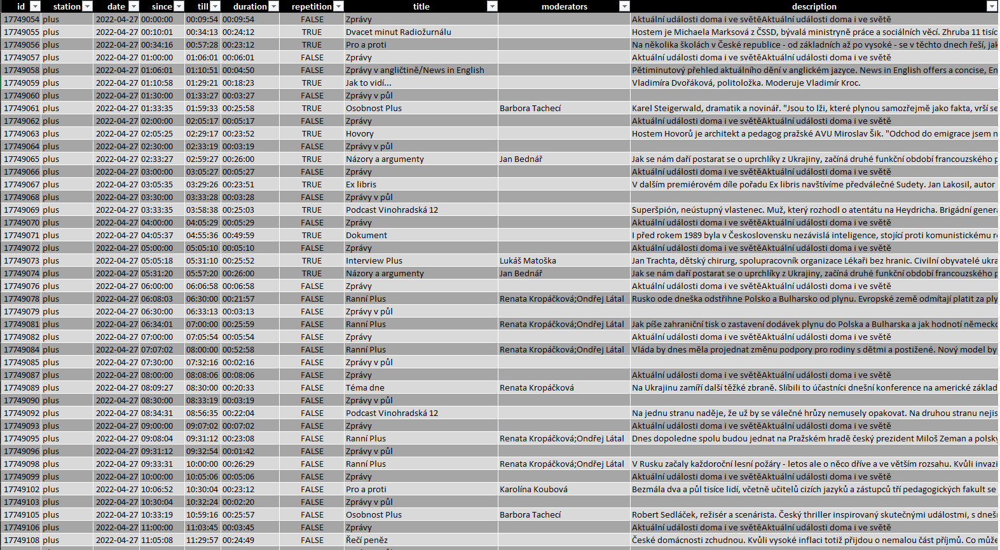

========
Schedule
========

`RELEASES <https://github.com/czech-radio/schedule/releases/>`__ \|
`WEBSITE <https://czech-radio.github.io/schedule/>`__

|build| |version| |language| |Codacy| |DeepSource|

.. |build| image:: https://github.com/czech-radio/cro.schedule/actions/workflows/main.yml/badge.svg
   :target: https://github.com/czech-radio/cro.schedule/actions/workflows/main.yml
.. |version| image:: https://img.shields.io/badge/version-1.2.0-blue.svg
.. |language| image:: https://img.shields.io/badge/language-Python-blue.svg
.. |Codacy| image:: https://app.codacy.com/project/badge/Grade/b68c6f5c2e204ac2b56581625dd336d1
   :target: https://www.codacy.com/gh/czech-radio/cro-schedule-sdk/dashboard?utm_source=github.com&utm_medium=referral&utm_content=czech-radio/cro-schedule-sdk&utm_campaign=Badge_Grade
.. |DeepSource| image:: https://deepsource.io/gh/groundf/schedule.svg/?label=active+issues&show_trend=true&token=_guN3-nr8w21gI-yCWjF-Bfy
   :target: https://deepsource.io/gh/groundf/schedule/?ref=repository-badge

**The library and program to work with Czech Radio schedules.**

*The library contains a client and domain model to work with Czech Radio
schedules. You will be able to download a schedule for the specified
station(s) and period e.g day, week, month, etc. The schedule contains
information about shows and you can easily work with the domain model in
your programs. At least you can export data as ``pandas.Dataframe`` and
play with that.*

Installation
------------

**Prerequisites**

-  We assume that you have `Git <https://git-scm.com/>`__ installed.
-  We assume that you use at least `Python <https://www.python.org/downloads/>`__ 3.10.
-  We assume that you use the `virtual environment <https://docs.python.org/3/library/venv.html>`__.

Install the package's latest version from the GitHub repository main branch.

.. code:: powershell

   pip install git+https://github.com/czech-radio/schedule.git

Features & Usage
----------------

.. note:: Data are available many years to the past and circa 14 days to the future.

Use as a library
~~~~~~~~~~~~~~~~

-  Get the available stations
   [`recipe <https://github.com/czech-radio/cro-schedule/blob/main/docs/source/notebooks/Recipe_Get_Stations.ipynb>`__].
-  Get the schedule for all stations and given day [recipe].
-  Get the schedule for the given station and day
   [`recipe <https://github.com/czech-radio/cro-schedule/blob/main/docs/source/notebooks/Recipe_Get_Schedule_Day.ipynb>`__].
-  Get the schedule for the given station and week
   [`recipe <https://github.com/czech-radio/cro-schedule/blob/main/docs/source/notebooks/Recipe_Get_Schedule_Week.ipynb>`__].
-  Get the schedule for the given station and month
   [`recipe <https://github.com/czech-radio/cro-schedule/blob/main/docs/source/notebooks/Recipe_Get_Schedule_Month.ipynb>`__].
-  Get the schedule for the given station and year
   [`recipe <https://github.com/czech-radio/cro-schedule/blob/main/docs/source/notebooks/Recipe_Get_Schedule_Year.ipynb>`__].
-  Get the schedule for the given station, any period and time
   [`recipe <https://github.com/czech-radio/cro-schedule/blob/main/docs/source/notebooks/Recipe_Get_Schedule_Any.ipynb>`__].
-  Convert schedule to ``pandas.DataFrame`` with
   ``Schedule::to_table()`` method.

See more examples in ``docs/source/notebooks`` directory or in `online documentation <https://czech-radio.github.io/schedule/>`__

Use as a program
~~~~~~~~~~~~~~~~

Get the day schedule
^^^^^^^^^^^^^^^^^^^^

.. code:: powershell

   cro.schedule -p D -d 2022-02-01 -s plus,radiozurnal -o .

.. code:: powershell

   Fetched 1 schedules for stations ['Plus', 'Radiozurnal'] and dates ['2022-02-01'].
   Result saved to ./Schedule_D2022-02-01.xlsx

Get the week schedule
^^^^^^^^^^^^^^^^^^^^^

.. code:: powershell

   cro.schedule --period W --date 2022-02-01 --stations plus,radiozurnal --output .

.. code:: powershell

   Fetched 7 schedules for stations ['Plus', 'Radiozurnal'] and dates ['2022-01-31', '2022-02-01', '2022-02-02', '2022-02-03', '2022-02-04', '2022-02-05', '2022-02-06'].
   Result saved to ./Schedule_W2022-02-01.xlsx

Get the month schedule
^^^^^^^^^^^^^^^^^^^^^^

.. code:: powershell

   cro.schedule --period M --date 2022-02-01 --stations plus,radiozurnal --output .

.. code:: powershell

   Fetched 28 schedules for stations ['Plus', 'Radiozurnal'] and dates ['2022-02-01', '2022-02-02', '2022-02-03', '2022-02-04', '2022-02-05', '2022-02-06', '2022-02-07', '2022-02-08', '2022-02-09', '2022-02-10', '2022-02-11', '2022-02-12', '2022-02-13', '2022-02-14', '2022-02-15', '2022-02-16', '2022-02-17', '2022-02-18', '2022-02-19', '2022-02-20', '2022-02-21', '2022-02-22', '2022-02-23', '2022-02-24', '2022-02-25', '2022-02-26', '2022-02-27', '2022-02-28'].
   Result saved to ./Schedule_M2022-02-01.xlsx

The resulting Excel/CSV table file looks like this:

   excel

Contribution
------------

See the document `here </.github/CONTRIBUTING.md>`__.

Documentation
-------------

The complete documentation `here <https://czech-radio.github.io/schedule/>`__

References
----------

-  `Czech Radio portal <https://portal.rozhlas.cz/>`__
-  `Czech Radio open data <https://data.irozhlas.cz/opendata/>`__
-  `Czech Radio on
   Wikipedia <https://cs.wikipedia.org/wiki/%C4%8Cesk%C3%BD_rozhlas>`__
